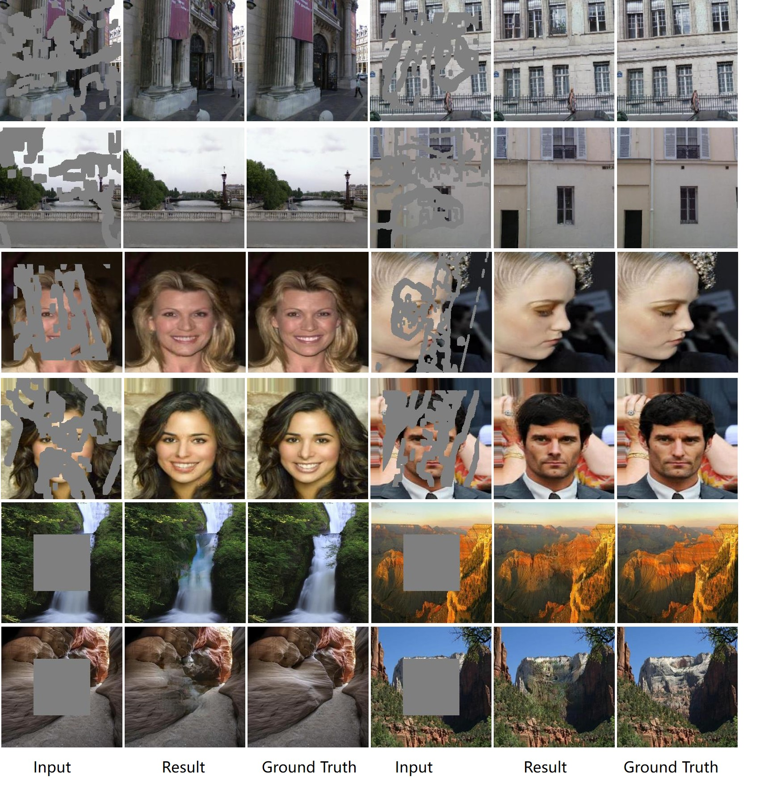
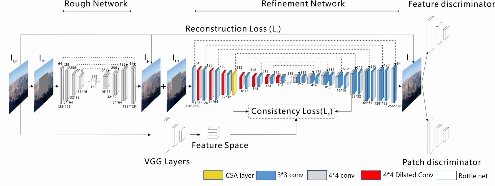
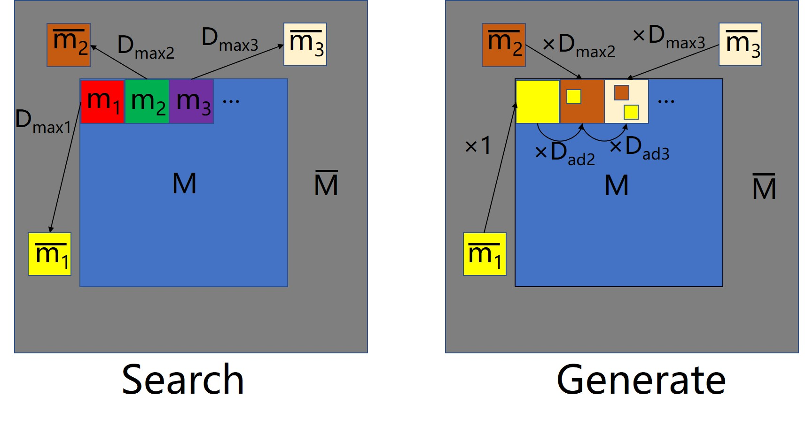
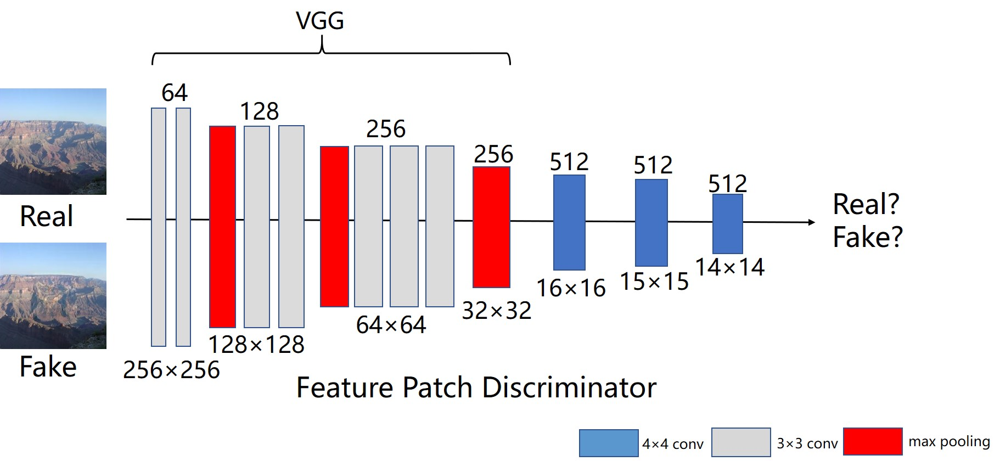

# Coherent Semantic Attention for image inpainting (ICCV 2019)

[Arxiv](https://arxiv.org/abs/1905.12384) |[ICCV 2019 paper](http://openaccess.thecvf.com/content_ICCV_2019/papers/Liu_Coherent_Semantic_Attention_for_Image_Inpainting_ICCV_2019_paper.pdf)| [BibTex](#jump1)

-----------

## 介绍

由于局部像素的不连续性（the discontinuity of the local pixels），现有的修复方法经常会产生纹理模糊（blurry textures），结构失真（distorted structures）的内容。从语义层面上看，局部像素的不连续性主要是因为这些方法忽略了语义相关性（semantic relevance）和孔区域（hole regions）的特征连续性。为了解决这个问题，我们研究了人类在修复图片中的行为，并提出了一种基于深度生成模型的，具有新颖连贯语义注意（coherent semantic attention，CSA）层的方法，该方法不仅可以保留上下文结构，而且通过对孔特征之间的语义相关性进行建模可以对缺失部分进行更有效的预测。同时，我们进一步提出一致性损失（consistency loss）和特征补丁鉴别器（feature patch discriminator），以稳定网络训练过程并改进细节。

<div align=center></div>

-------------

## 模型架构

<div align=center></div>

### CSA 架构

<div align=center></div>

### 特征补丁识别器

<div align=center></div>

-------------

## 先决条件

* Windows or Linux
* Python3
* Pytorch 1.0
* NVIDIA GPU + CUDA CuDNN.
* Jupyter Notebook

--------------

## 安装

* 克隆此仓库：

```sh
git clone https://github.com/xinetzone/CSA-inpainting
cd CSA-inpainting
```

* 安装 [PyTorch 和依赖项](http://pytorch.org)

* 或者，您可以克隆存储库并由conda运行

```sh
conda env create -f environment.yaml 
conda activate csa-inpainting
jupyter notebook
```

打开浏览器并输入 URL `http://localhost:8080` 以使用 Jupyter Notebook

--------------

## 数据

我们使用 [Places2](http://places2.csail.mit.edu/)，[CelebA](http://mmlab.ie.cuhk.edu.hk/projects/CelebA.html) 和 [Paris Street-View](https://github.com/pathak22/context-encoder) 数据集。要在完整数据集上训练模型，请从官方网站下载数据集。

我们的模型是 [Liu 等](https://arxiv.org/abs/1804.07723) 人提供的不规则蒙版数据集上训练的。您可以从公开可用的 [不规则蒙版数据集](http://masc.cs.gmu.edu/wiki/partialconv) 下载使用。

## 模型训练

* 下载您自己的修复数据集。
*  在 Jupyter Notebook 中打开 `train.ipynb`
* 修改选项类以设置 `data_root`，`mask_root`，`checkpoints_dir`，`mask_type` 和其他参数。
* 运行 `train.ipynb`

## 模型测试
* 在 Jupyter Notebook 中打开 `test.ipynb`
* 保持与训练期间相同的参数
* 运行 `test.ipynb`

## License

CC 4.0 署名-非商业国际。该软件仅用于教育和学术研究目的。

## <span id="jump1">引文</span>

```
@InProceedings{Liu_2019_CSA,
    Author = {Hongyu Liu and Bin Jiang and Yi Xiao and Chao Yang},
    Title = {Coherent Semantic Attention for Image Inpainting},
    booktitle = { IEEE International Conference on Computer Vision (ICCV)},
    month = {July},
    year = {2019}
    
}
```

## 致谢

我们从 [Shift-net](https://github.com/Zhaoyi-Yan/Shift-Net_pytorch) 中受益匪浅。

